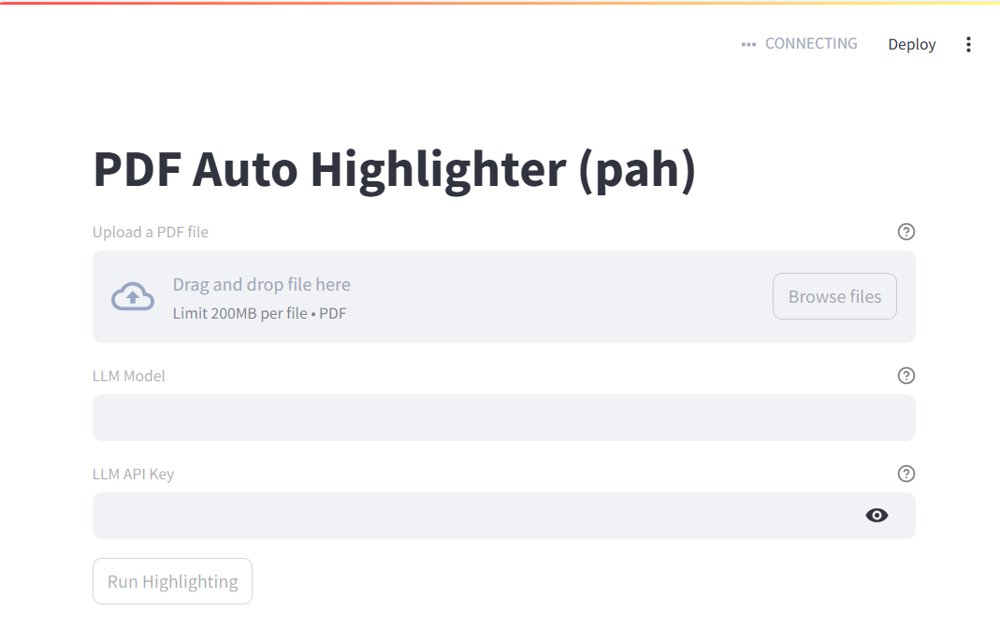

# pah

[](https://pypi.org/project/pah/) [](https://pypi.org/project/pah-core/) [](https://pypi.org/project/pah-gui/)

PDF Auto Highlighter

## Usage

```bash
pip install pah
```

```bash
$ pah --help
usage: pah [-h] {highlight,gui} ...

pah: PDF Auto Highlighter

options:
  -h, --help       show this help message and exit

subcommands:
  {highlight,gui}
    highlight      highlight a PDF using LLMs
    gui            Run pah on the Web
```

### As a CLI tool

```bash
$ pah highlight --help
usage: pah highlight [-h] -o OUTPUT -m MODEL [-p PROMPT] [--output-page-texts OUTPUT_PAGE_TEXTS] [--output-highlights OUTPUT_HIGHLIGHTS]
                     [--log-level {DEBUG,INFO,WARNING,ERROR,CRITICAL}]
                     input_pdf_path

positional arguments:
  input_pdf_path        Input PDF file

options:
  -h, --help            show this help message and exit
  -o, --output OUTPUT   Output PDF file with highlights
  -m, --model MODEL     LLM model to use (See https://litellm.vercel.app/docs/providers)
  -p, --prompt PROMPT   Prompt to use for highlighting
  --output-page-texts OUTPUT_PAGE_TEXTS
                        Output JSON file for page texts
  --output-highlights OUTPUT_HIGHLIGHTS
                        Output JSON file for highlights
  --log-level {DEBUG,INFO,WARNING,ERROR,CRITICAL}
                        Logging level (default: INFO)
```

```bash
pah -o output.pdf -m gpt-4o input.pdf

# or
# uvx pah -o output.pdf -m gpt-4o input.pdf
```

### As a Python library

```python
from pah import PAH

pah = PAH(
    input_pdf_path="input.pdf",
    output_pdf_path="output.pdf",
    llm_model="gpt-4o",
    output_highlights_path="highlights.json"
)
pah.highlight()
```

### As a GUI tool



```bash
pip install pah[gui]
```

```bash
pah gui --help
usage: pah gui [-h]

options:
  -h, --help  show this help message and exit
```

```bash
pah gui

# or
# uvx pah[gui] gui
```
